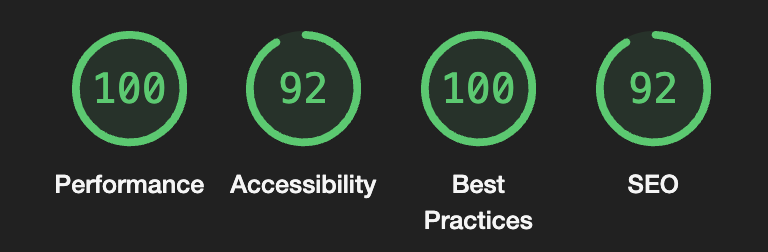
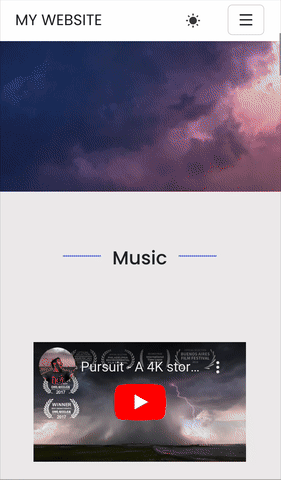
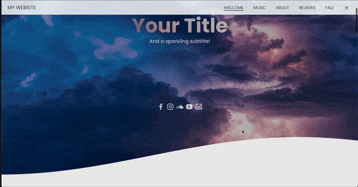
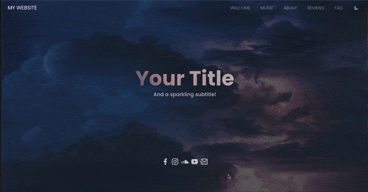

# BAH Starter Kit

This kit provides a pre-configured static single page Astro site setup designed with Bootstrap and data served by the Hygraph API. This is meant for smaller presentation oriented websites, such as a band website, personal portfolio or the like. 

### Technical overview

- [Astro](https://astro.build/)
- [Bootstrap 5.3](https://getbootstrap.com/)
- [Hygraph](https://hygraph.com/) API setup ([Clone this project](https://app.hygraph.com/clone/e6bf5add61b5452db93ed8e557e49994?name=BAH%20Starter%20Kit))
- [AOS](https://michalsnik.github.io/aos/) to easily animate elements
- [Netlify](https://docs.netlify.com/frameworks/astro/) integration (read Deployment)
- MDX integration for rich text alternative
- [swiffy-slider](https://swiffyslider.com/) for slider component
- [Playform/Inline](https://github.com/PlayForm/Inline) for lazy loading non-critical CSS

### Design features

**Responsive** using Bootstrap utility classes and media queries

**Dark mode**. Easy re-mapping of Bootstrap color variables (`theme.scss`) for light/dark theme and reusable `ThemePicker` component. Animation keyframes fades in selected theme.

Scrollspy integrated navbar experience. AOS wrapper component with optional parameters to animate elements.

## Getting Started 

### Prerequisites

Before cloning this project, you ensure that you have:
- A Hygraph account (free or paid) and a [clone of this project](https://app.hygraph.com/clone/e6bf5add61b5452db93ed8e557e49994?name=BAH%20Starter%20Kit)
- (Optional) A Netlify account eventually to deploy your project
- Beginner level Astro
- Familiarity with working in a NodeJS powered projects (npm, source/build files etc)
- Beginner level TypeScript and SCSS

### Installing

Clone or download the project and the following commands to install, run and build the project

| Command                   | Action                                           |
| :------------------------ | :----------------------------------------------- |
| `npm install`             | Installs dependencies                            |
| `npm run dev`             | Starts local dev server at `localhost:4321`      |
| `npm run build`           | Build your production site to `./dist/`          |
| `npm run preview`         | Preview your build locally, before deploying     |
| `npm run astro ...`       | Run CLI commands like `astro add`, `astro check` |
| `npm run astro -- --help` | Get help using the Astro CLI                     |

## Project Overview

As a base for the data models in Hygraph, each section on the site is a `Section`. Sections will be rendered as a menu tab unless `includeInNavition` is set to `false`.

A `Section` have can have a title, subtitle, background image (used as example in the `HeroImage` component) and `n` `Subsections`, which can be utilized as columns. 

Each section is for now called statically in `SectionRenderer.astro`, 

## Deployment

The project comes with Netlify integration installed, but free to deploy from any provider. You may refer to Astro documentation for the supported deployment integration options. 

To deploy on Netlify, follow [Netlify's guide to deploy an Astro project](https://docs.netlify.com/frameworks/astro/), or link your local repository with Netlify [using the Netlify CLI](https://github.com/netlify-templates/astro-platform-starter?tab=readme-ov-file#developing-locally).

## Contributing

You are more than welcome to contribute to making this project even better! A non-exhaustive list of future work that comes to mind is:

- Dynamically loading components using a field to specify the component type
- Support pages with slugs served by Hygraph
- Tidy up mappings of section and subsection fields
- Unit tests and end-to-end tests
- Improve API stability 
- A 100 Lighthouse score
- Refactoring contributions in general
- Row and column implementation in Footer scheme